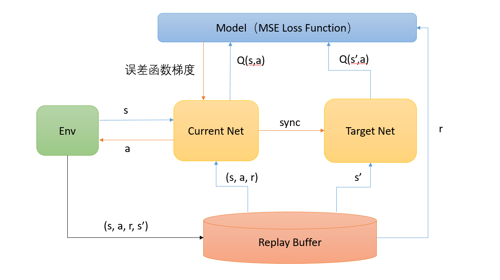

# 目录

## DQN
DQN是一种基于Q-learning的强化学习算法。
[论文](https://arxiv.org/pdf/1312.5602.pdf)：Playing Atari with Deep Reinforcement Learning, Mnih et al, 2013. 
这是基于XingTian（刑天）框架以及Mindspore（昇思）框架实现的DQN算法

刑天 (XingTian) 是一个组件化强化学习库，用于开发、验证强化学习算法。它目前已支持包括DQN、DDPG、PPO和IMPALA等系列算法，可以在多种环境中训练智能体，如Gym、Atari、Torcs、StarCraftII等。 为了满足用户快速验证和解决RL问题的需求，刑天抽象出了四个模块：`Algorithm`,`Model`,`Agent`,`Environment`。它们的工作方式类似于"乐高"积木的组合。
## 模型架构

DQN模型基于深度神经网络，将深度神经网络与Q-learning相结合，网络结构为三个卷积层和两个全连接层。使用DQN算法根据来自Replay Buffer的一批数据训练模型。 它首先使用参与者和目标参与者模型预测当前状态和下一个状态的 Q 值。 然后计算 TD 误差并使用预测 Q 值和目标 Q 值更新参与者模型。同时接收数据并将每个Item作为状态、动作、奖励、下一状态和完成的元组添加到Replay Buffer。代理在网络学习的驱动下进行探索，对环境的反馈进行处理做出Action和状态更新，触发训练过程。



更多细节可以参考[原论文](https://arxiv.org/pdf/1312.5602.pdf)。
## 数据集

DQN作为一种强化学习算法，模型通过和环境交互收集样本更新参数权重。我们在gym上训练智能体。Gym是一个最广泛使用的强化学习实验环境，内置上百种实验环境，比如一些简单几何体的运动，一些用文本表示的简单游戏，或者机械臂的抓取和控制等实验环境,我们用dqn训练了几种atari游戏，包括beamrider,breakout,qbert,spaceinvader。通过智能体与环境交互获得状态动作、奖励、下一状态，并将这些值代入神经网络训练，以获得理想结果。

## 环境要求

* 硬件（GPU or NPU）
    * 使用GPU处理器或者NPU处理器来搭建硬件环境。
* 框架
    * MindSpore(2.0.0)，参考MindSpore-2.0.0版本的[安装教程](https://mindspore.cn/install)
    * XingTian(0.3.0)，参考XingTian的[安装教程](https://github.com/huawei-noah/xingtian)
* 其他第三方库参考`requirements.txt`
## 快速入门

完成框架安装和环境配之后，你可以按照如下步骤进行模型的训练和评估

```
cd xingtian
# 训练
xt_main -f examples/<game-name>_dqn_ms.yaml -t train

# 训练和评估
xt_main -f examples/<game-name>_dqn_ms.yaml -t train_with_evaluate
```

## 脚本说明

### 脚本和样例代码

```bash
.
xt/model/dqn
├── __init__.py
├── default_config.py    # 参数配置
├── dqn_cnn_pong_ms.py
├── dqn_cnn_pong.py
├── dqn_cnn.py
├── dqn_cnn_zeus.py
├── dqn_zeus.py 
├── dqn_mlp.py
├── dqn_mlp_zeus.py
├── dqn_rec_model.py
├── dqn_mlp_ms.py        # Mindspore实现采用多层感知机的DQN算法
└── dqn_cnn_ms.py        # Mindspore实现采用卷积神经网络的DQN算法
```

### 脚本参数

下面是一个有关 DQN算法的参数示例，我们通过配置系统中已注册的算法，环境信息来组合训练任务。有关不同参数更详细的描述可以在[用户指导](./docs/user.cn.md) 中找到。基于Mindspore实现的DQN算法训练配置脚本位于```examples/<game-name>_dqn_ms.yaml```中


```yaml
alg_para:
  alg_name: DQN                                                             # 算法配置
  alg_config: {
    'train_per_checkpoint': 50,
    'prepare_times_per_train': 4,
    'learning_starts': 10000,
    'BUFFER_SIZE': 400000,
    }

env_para:
  env_name: AtariEnv                                                        # 环境配置
  env_info: { 'name': SpaceInvadersNoFrameskip-v4, 'vision': False}

agent_para:                                                                 # agent配置
  agent_name: AtariDqn
  agent_num : 1
  agent_config: {
    'max_steps': 2000,
    'complete_step': 10000000,
    'episode_count': 200000
    }

model_para:                                                                 # 模型参数
  actor:
    model_name: DqnCnnMS
    state_dim: [84,84,4]
    action_dim: 6
    model_config: {
      'LR': 0.00015,
      }

env_num: 2                                                                  # 启动的环境数量

```

另外在 [examples](./examples) 目录下，可以找到更加丰富的训练配置示例。


## 训练过程

### 训练

通过以下命令训练
```
xt_main -f examples/<game-name>_dqn_ms.yaml -t train > train.log 2>&1 &
```
训练日志将会被保存到train.log中
```
# train.log示例
...
INFO [My-Labtop 222.20.75.218] Apr 29 00:13:15: Task: T0         | Train_count:    249990 | Steps: 499981224 | Elapsed time: 9 days, 13 minutes, 43 seconds
mean_env_step_ms:         1.927544	mean_explore_ms:        16594.248891	mean_inference_ms:       80.986863	mean_loop_time_ms:      3086.343014
mean_prepare_data_ms:    40.179479	mean_restore_model_ms:    1.536433	mean_train_time_ms:     589.716685	mean_wait_model_ms:       0.024343
mean_wait_sample_ms:    206.692171	step_per_second:             642.0	train_loss:               7.732563	train_reward_avg:           420.73
...
```

### 训练和评估
通过以下命令训练和评估
```
xt_main -f examples/<game-name>_dqn_ms.yaml -t train_with_evaluate > train.log 2>&1 &
```

## 精度和性能

* 10M step 之后的DQN 收敛回报 (40M frames)
    | env           | DQN On Mindspore(NPU) | DQN On Mindspore(GPU) |DQN On Tensorflow |
    | ------------- | ------------ | --------- |-------------|
    | BeamRider     | 11010        | 10492     |     6706    |
    | Breakout      | 376          | 365       |     352     |
    | QBert         | 13746        | 11905     |     14087   |
    | SpaceInvaders | 1410         | 1270       |     947     |


* 吞吐量(step per second)
    | env           | DQN On Mindspore(NPU)  | DQN On Mindspore(GPU)| DQN On Tensorflow|
    | ------------- | ------------ | --------- |--------------|
    | BeamRider     | 124          |133        |129           |
    | Breakout      | 128          |131        |117           |
    | QBert         | 139          |138        |111           |
    | SpaceInvaders | 133          |136        |115           |

> 实验硬件环境: 
> 
> TF     72  Intel(R) Xeon(R) Gold 6154 CPU @ 3.00GHz with single Tesla V100
> 
> MS NPU 72  Intel(R) Xeon(R) Gold 6240 CPU @ 2.60GHz with single Ascend 910
>
> MS GPU 20 Intel(R) Xeon(R) Gold 6230 CPU @ 2.10GHz *2  with single RTX2080Ti