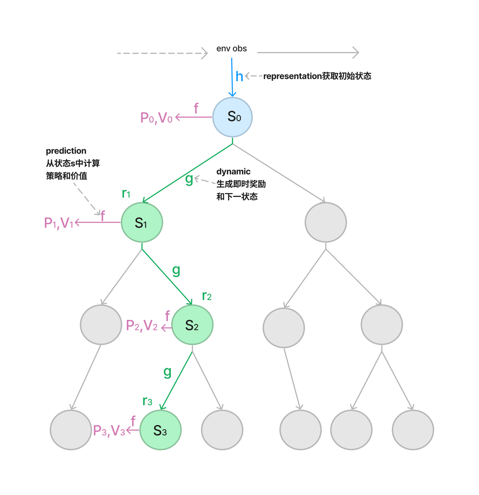

# 目录
## Muzero
MuZero是DeepMind于19年发布的model based算法，是AlphaZero的又一升级。DeepMind将算法推广至更大的适用范围。这篇文章的主要贡献在于不需要规则这一先验信息，并且在MCTS的搜索过程完全建立在hidden state上。最终在雅达利的各类游戏上取得了重大突破，而不只是局限于棋类游戏。
[论文:Mastering Atari, Go, Chess and Shogi by Planning with a Learned Model](https://arxiv.org/abs/1911.08265)

## 模型架构
在每一个step中，隐藏状态执行一次蒙特卡洛树搜索的到下一个动作。

- prediction：预测器。神经网络f，依据的“游戏状态”是一个隐藏表征，预测给定游戏状态下的策略p和价值v。
- dynamics：生成器，表示系统中的动态变化。 神经网络g生成隐藏表征。动力学网络获取当前隐藏状态s和动作a，产生一个即时奖励r（immediate reward）和一个新的隐藏状态s。
-  representation：表征编码器，从历史观测，转换为初始状态。神经网络h 将当前观测到的游戏状态映射到初始表征。


## 数据集
MuZero模型在XingTian框架的游戏breakout、pong的环境下进行强化学习训练。通过智能体与环境交互获得状态动作、奖励、下一状态，并将这些值代入神经网络训练，以获得理想结果。

## 环境要求
* 硬件（GPU or NPU）
    * 使用GPU处理器或者NPU处理器来搭建硬件环境。
* 框架
    * MindSpore(2.0.0)，参考MindSpore-2.0.0版本的[安装教程](https://mindspore.cn/install)
    * XingTian(0.3.0)，参考XingTian的[安装教程](https://github.com/huawei-noah/xingtian)
* 其他第三方库参考`requirements.txt`

## 快速入门
完成框架安装和环境配之后，你可以按照如下步骤进行模型的训练和评估
```
cd xingtian
# 训练
xt_main -f examples/muzero/muzero_<game-name>_ms.yaml -t train

# 训练和评估
xt_main -f examples/muzero/muzero_<game-name>_ms.yaml -t train_with_evaluate
```

## 文件结构说明

### 文件目录
```
xingtian/xt/model/muzero
├── __init__.py
├── default_config.py
├── muzero_atari.py
├── muzero_cnn_ms.py        # Mindspore实现采用卷积神经网络的Muzero算法
├── muzero_cnn.py
├── muzero_mlp_ms.py        # Mindspore实现采用多层感知机的Muzero算法
├── muzero_mlp.py
├── muzero_model_ms.py      # Mindspore实现Muzero算法基类
├── muzero_model.py
├── muzero_utils_ms.py
└── muzero_utils.pys
```

### 训练配置
下面是一个有关Muzero算法的参数示例，我们通过配置系统中已注册的算法，环境信息来组合训练任务。有关不同参数更详细的描述可以在[用户指导](./docs/user.cn.md) 中找到。基于Mindspore实现的Muzero算法训练配置脚本位于```examples/muzero/muzero_breakout_ms.yaml```中

```yaml
# examples/muzero/muzero__ms.yaml
alg_para:                           # 算法配置
  alg_name: Muzero
  alg_config: {
    "train_per_checkpoint": 100,
    "prepare_times_per_train": 10,
    'BUFFER_SIZE': 10000,
    }

env_para:                           # 环境配置
  env_name: AtariEnv
  env_info: { 'name': BreakoutNoFrameskip-v4, vision': False}

agent_para:                         # agent配置
  agent_name: MuzeroAtari
  agent_num : 1
  agent_config: {
    'max_steps': 200 ,                  # agent最大步数
    'complete_step': 500000000,         # agent训练完成帧数
    'NUM_SIMULATIONS': 50               # 模型参数
    }

model_para:
  actor:
    model_name: MuzeroCnnMS
    state_dim: [84, 84, 4]
    action_dim: 4
    max_to_keep: 500
    model_config: {
      'reward_min': 0,
      'reward_max': 50,
      'value_min': 0,
      'value_max': 500,
      'obs_type': 'uint8'
      }

env_num: 50                         # 启动的环境数量
speedup: False                      # 是否使用核绑定来加速
```
另外在 [examples](./examples) 目录下，可以找到更加丰富的训练配置示例。

## 训练过程

### 训练

通过以下命令训练
```
xt_main -f examples/muzero/muzero_<game-name>_ms.yaml -t train > train.log 2>&1 &
```
训练日志将会被保存到train.log中
```
# train.log示例
...
INFO [My-Labtop 222.20.75.218] Apr 29 00:13:15: Task: T0         | Train_count:    249990 | Steps: 499981224 | Elapsed time: 9 days, 13 minutes, 43 seconds
mean_env_step_ms:         1.927544	mean_explore_ms:        16594.248891	mean_inference_ms:       80.986863	mean_loop_time_ms:      3086.343014
mean_prepare_data_ms:    40.179479	mean_restore_model_ms:    1.536433	mean_train_time_ms:     589.716685	mean_wait_model_ms:       0.024343
mean_wait_sample_ms:    206.692171	step_per_second:             642.0	train_loss:               7.732563	train_reward_avg:           420.73
...
```

### 训练和评估
通过以下命令训练和评估
```
xt_main -f examples/muzero/muzero_<game-name>_ms.yaml -t train_with_evaluate > train.log 2>&1 &
```

## 性能

* 500M step 之后的Muzero 收敛回报 (40M frames)
    | env           | Muzero On Mindspore(NPU) | Muzero On Mindspore(GPU) |Muzero On Tensorflow |
    | ------------- | ------------ | --------- |-------------|
    | Breakout      | 388          | 417       |     413     |


* 吞吐量(step per second)
    | env           | Muzero On Mindspore(NPU)  | Muzero On Mindspore(GPU)| Muzero On Tensorflow|
    | ------------- | ------------ | --------- |--------------|
    | Breakout      | 503          |642        |892           |

> 实验硬件环境: 
> 
> TF     72  Intel(R) Xeon(R) Gold 6154 CPU @ 3.00GHz with single Tesla V100
> 
> MS NPU 72  Intel(R) Xeon(R) Gold 6240 CPU @ 2.60GHz with single Ascend 910
>
> MS GPU 20 Intel(R) Xeon(R) Gold 6230 CPU @ 2.10GHz *2  with single RTX2080Ti
