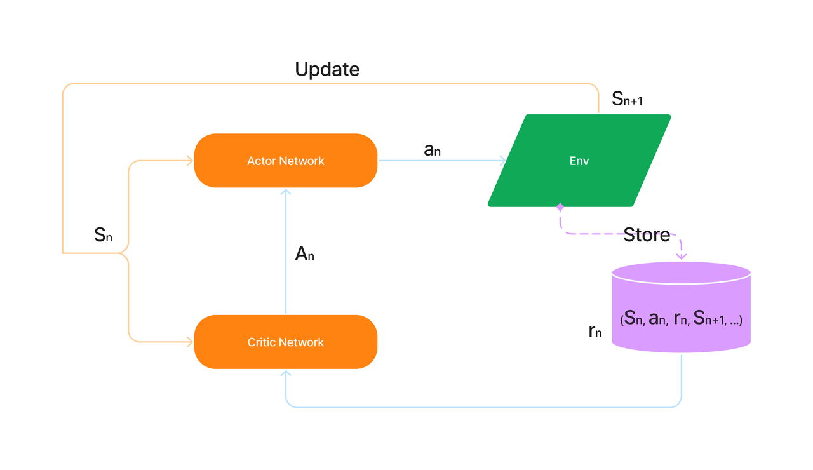

# 目录
## PPO
近端策略优化（PPO）算法是OpenAI在2017提出的一种强化学习算法，被认为是目前强化学习领域的SOTA方法，也是适用性最广的算法之一。
[论文](https://arxiv.org/pdf/1707.06347)

刑天 (XingTian) 是一个组件化强化学习库，用于开发、验证强化学习算法。它目前已支持包括DQN、DDPG、PPO和IMPALA等系列算法，可以在多种环境中训练智能体，如Gym、Atari、Torcs、StarCraftII等。 为了满足用户快速验证和解决RL问题的需求，刑天抽象出了四个模块：`Algorithm`,`Model`,`Agent`,`Environment`。它们的工作方式类似于"乐高"

## 模型架构
PPO网络模型采用Actor-Critic结构。Actor网络用于生成策略，根据当前状态生成一个动作概率分布，然后根据这个分布选择一个动作；Critic网络用于评估策略的好坏，根据当前状态和选择的动作评估该动作的价值，并输出一个价值估计。这个价值估计可以用来计算策略的优劣，从而对策略进行更新。
PPO算法的核心是通过优化策略来最大化累积回报。为了实现这一点，PPO算法采用了一种叫做“近端策略优化”的技术，即通过限制新策略和旧策略之间的差异来控制更新的幅度，以避免更新过度。



更多细节可以参考[原论文](https://arxiv.org/pdf/1707.06347)。

## 数据集
PPO模型在XingTian框架的游戏beamrider、breakout、qbert、spaceinvader的环境下进行强化学习训练。通过智能体与环境交互获得状态动作、奖励、下一状态，并将这些值代入神经网络训练，以获得理想结果。

## 环境要求
* 硬件（GPU or NPU）
    * 使用GPU处理器或者NPU处理器来搭建硬件环境。
* 框架
    * MindSpore(2.0.0)，参考MindSpore-2.0.0版本的[安装教程](https://mindspore.cn/install)
    * XingTian(0.3.0)，参考XingTian的[安装教程](https://github.com/huawei-noah/xingtian)
* 其他第三方库参考`requirements.txt`

## 快速入门
完成框架安装和环境配之后，你可以按照如下步骤进行模型的训练和评估
```
cd xingtian
# 训练
xt_main -f examples/<game-name>_ppo_ms.yaml -t train

# 训练和评估
xt_main -f examples/<game-name>_ppo_ms.yaml -t train_with_evaluate
```

## 文件结构说明

### 文件目录
```
xingtian/xt/model/ppo
├── default_config.py   #参数配置
├── __init__.py
├── ppo_cnn_pigs.py
├── ppo_mlp_zeus.py
├── ppo_cnn_zeus.py
├── ppo_cnn_ms.py       # Mindspore实现采用卷积神经网络的PPO算法
├── ppo_cnn.py          
├── ppo_mlp_ms.py       # Mindspore实现采用多层感知机的PPO算法
├── ppo_mlp.py          
├── ppo_ms.py           # Mindspore实现的PPO算法基类
└── ppo.py              
```

### 训练配置
下面是一个有关 PPO算法的参数示例，我们通过配置系统中已注册的算法，环境信息来组合训练任务。有关不同参数更详细的描述可以在[用户指导](./docs/user.cn.md) 中找到。基于Mindspore实现的PPO算法训练配置脚本位于```examples/<game-name>_ppo_ms.yaml```中

```yaml
# examples/beamrider_ppo_ms.yaml
alg_para:                           # 算法配置
  alg_name: PPO                     

env_para:                           # 环境配置
  env_name: AtariEnv
  env_info:
    name: BeamRiderNoFrameskip-v4
    vision: False

agent_para:                         # agent配置
  agent_name: AtariPpo
  agent_num : 1
  agent_config:
    max_steps: 128                  # agent最大步数
    complete_step: 10000000         # agent训练完成帧数

model_para:                         # 模型参数
  actor:
    model_name: PpoCnnMS
    state_dim: [84, 84, 4]
    action_dim: 9
    input_dtype: uint8
    model_config:
      BATCH_SIZE: 320
      CRITIC_LOSS_COEF: 1.0
      ENTROPY_LOSS: 0.003
      LOSS_CLIPPING: 0.1
      LR: 0.00025
      MAX_GRAD_NORM: 5.0
      NUM_SGD_ITER: 4
      SUMMARY: False
      VF_SHARE_LAYERS: True
      activation: relu
      hidden_sizes: [512]
      USE_AMSGRAD: False
env_num: 10                         # 启动的环境数量
speedup: False                      # 是否使用核绑定来加速

benchmark:
  log_interval_to_train: 10
```
另外在 [examples](./examples) 目录下，可以找到更加丰富的训练配置示例。

## 训练过程

### 训练

通过以下命令训练
```
xt_main -f examples/<game-name>_ppo_ms.yaml -t train > train.log 2>&1 &
```
训练日志将会被保存到train.log中
```
# train.log示例
...
INFO [My-Labtop 222.20.75.218] Apr 29 00:13:15: Task: T0         | Train_count:    249990 | Steps: 499981224 | Elapsed time: 9 days, 13 minutes, 43 seconds
mean_env_step_ms:         1.927544	mean_explore_ms:        16594.248891	mean_inference_ms:       80.986863	mean_loop_time_ms:      3086.343014
mean_prepare_data_ms:    40.179479	mean_restore_model_ms:    1.536433	mean_train_time_ms:     589.716685	mean_wait_model_ms:       0.024343
mean_wait_sample_ms:    206.692171	step_per_second:             642.0	train_loss:               7.732563	train_reward_avg:           420.73
...
```

### 训练和评估
通过以下命令训练和评估
```
xt_main -f examples/<game-name>_ppo_ms.yaml -t train_with_evaluate > train.log 2>&1 &
```

## 性能

* 10M step 之后的PPO 收敛回报 (40M frames)
    | env           | PPO On Mindspore(NPU) | PPO On Mindspore(GPU) |PPO On Tensorflow |
    | ------------- | ------------ | --------- |-------------|
    | BeamRider     | 4424         | 4677      |     4877    |
    | Breakout      | 344          | 283       |     341     |
    | QBert         | 14246        | 14561     |     14771   |
    | SpaceInvaders | 1279         | 974       |     1025    |


* 吞吐量(step per second)
    | env           | PPO On Mindspore(NPU)  | PPO On Mindspore(GPU)| PPO On Tensorflow|
    | ------------- | ------------ | --------- |--------------|
    | BeamRider     | 1788          |2053        |2422           |
    | Breakout      | 2081          |2347        |2497           |
    | QBert         | 1802          |2152        |2436           |
    | SpaceInvaders | 1793          |2163        |2438           |

> 实验硬件环境: 
> 
> TF     72  Intel(R) Xeon(R) Gold 6154 CPU @ 3.00GHz with single Tesla V100
> 
> MS NPU 72  Intel(R) Xeon(R) Gold 6240 CPU @ 2.60GHz with single Ascend 910
>
> MS GPU 20 Intel(R) Xeon(R) Gold 6230 CPU @ 2.10GHz *2  with single RTX2080Ti
