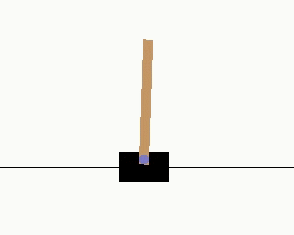

<div align="center">

</div>


[中文](./README.cn.md)

## Introduction 

[](https://opensource.org/licenses/MIT)

**XingTian (刑天)** is a componentized library for the development and verification of reinforcement learning algorithms. It supports multiple algorithms, including DQN, DDPG, PPO, and IMPALA etc, which could training agents in multiple environments, such as Gym, Atari, Torcs, StarCraftII and so on.  To meet users' requirements for quick verification and solving RL problems, four modules are abstracted: `Algorithm`, `Model`, `Agent`, and `Environment`. They work in a similar way as the combination of `Lego' building blocks. For details about the architecture, please see the [Architecture introduction](./docs/basic_arch.en.md). 

## Dependencies

```shell
# ubuntu 18.04
sudo apt-get install python3-pip libopencv-dev -y
pip3 install opencv-python

# run with tensorflow 1.15.0 or tensorflow 2.3.1
pip3 install zmq h5py gym[atari] tqdm imageio matplotlib==3.0.3 Ipython pyyaml tensorflow==1.15.0 pyarrow lz4 fabric2 absl-py psutil tensorboardX setproctitle
```

or, using `pip3 install -r requirements.txt`

If your want to used PyTorch as the backend, please install it by yourself.  [Ref Pytorch](https://pytorch.org/get-started/locally/)


## Installation
```zsh
# cd PATH/TO/XingTian 
pip3 install -e .
```

After installation, you could use `import xt; print(xt.__Version__)`  to check whether the installation is successful. 

```python
In [1]: import xt

In [2]: xt.__version__
Out[2]: '0.3.0'
```


## Quick Start

---------
#### Setup configuration
Follow's configuration shows a minimal example with [Cartpole](https://gym.openai.com/envs/CartPole-v0/) environment. 
More detailed description with the parameters of agent, algorithm and environment could been find in the [User guide](./docs/user.en.md) . 


```yaml
alg_para:
  alg_name: PPO
  alg_config:
    process_num: 1
    save_model: True  # default False
    save_interval: 100

env_para:
  env_name: GymEnv
  env_info:
    name: CartPole-v0
    vision: False

agent_para:
  agent_name: PPO
  agent_num : 1
  agent_config:
    max_steps: 200
    complete_step: 1000000
    complete_episode: 3550

model_para:
  actor:
    model_name: PpoMlp
    state_dim: [4]
    action_dim: 2
    input_dtype: float32
    model_config:
      BATCH_SIZE: 200
      CRITIC_LOSS_COEF: 1.0
      ENTROPY_LOSS: 0.01
      LR: 0.0003
      LOSS_CLIPPING: 0.2
      MAX_GRAD_NORM: 5.0
      NUM_SGD_ITER: 8
      SUMMARY: False
      VF_SHARE_LAYERS: False
      activation: tanh
      hidden_sizes: [64, 64]

env_num: 10
```

In addition, your could find more configuration sets in [examples](./examples) directory.

#### Start training task

```python3 xt/main.py -f examples/cartpole_ppo.yaml -t train```

  


#### Evaluate local trained model

Set `benchmark.eval.model_path` for evaluation within the `YOUR_CONFIG_FILE.yaml`

```
benchmark:
  eval:
    model_path: /YOUR/PATH/TO/EVAL/models
    gap: 10           # index gap of eval model
    evaluator_num: 1  # the number of evaluator instance

# run command
python3 xt/main.py -f examples/cartpole_ppo.yaml -t evaluate
```

> NOTE: XingTian start with `-t train ` as default.

#### Run with CLI

```zsh
# Could replace `python3 xt/main.py` with `xt_main` command!
xt_main -f examples/cartpole_ppo.yaml -t train

# train with evaluate
xt_main -f examples/cartpole_ppo.yaml -t train_with_evaluate
```

## Develop with Custom case

1. Write custom module, and register it. More detail guidance on custom module can be found in the [Developer Guide](./docs/developer.en.md)
2. Add YOUR-CUSTOM-MODULE name into `your_train_configure.yaml`
3. Start training with `xt_main -f path/to/your_train_configure.yaml` :)


## Reference Results

#### Episode Reward Average

1. **DQN** Reward after 10M time-steps (**40M frames**).

   | env           | XingTian Basic DQN | RLlib Basic DQN | Hessel et al. DQN |
   | ------------- | ------------------ | --------------- | ----------------- |
   | BeamRider     | 6706               | 2869            | ~2000             |
   | Breakout      | 352                | 287             | ~150              |
   | QBert         | 14087              | 3921            | ~4000             |
   | SpaceInvaders | 947                | 650             | ~500              |

2. **PPO** Reward after 10M time-steps (**40M frames**).

   | env           | XingTian PPO | RLlib PPO | Baselines PPO |
   | ------------- | ------------ | --------- | ------------- |
   | BeamRider     | 4877         | 2807      | ~1800         |
   | Breakout      | 341          | 104       | ~250          |
   | QBert         | 14771        | 11085     | ~14000        |
   | SpaceInvaders | 1025         | 671       | ~800          |

3. **IMPALA** Reward after 10M time-steps (**40M frames**).

   | env           | XingTian IMPALA | RLlib IMPALA |
   | ------------- | --------------- | ------------ |
   | BeamRider     | 2313            | 2071         |
   | Breakout      | 334             | 385          |
   | QBert         | 12205           | 4068         |
   | SpaceInvaders | 742             | 719          |


#### Throughput

1. **DQN**

   | env           | XingTian Basic DQN | RLlib Basic DQN |
   | ------------- | ------------------ | --------------- |
   | BeamRider     | 129                | 109             |
   | Breakout      | 117                | 113             |
   | QBert         | 111                | 90              |
   | SpaceInvaders | 115                | 100             |

2. **PPO**

   | env           | XingTian PPO | RLlib PPO |
   | ------------- | ------------ | --------- |
   | BeamRider     | 2422         | 1618      |
   | Breakout      | 2497         | 1535      |
   | QBert         | 2436         | 1617      |
   | SpaceInvaders | 2438         | 1608      |

3. **IMPALA**

   | env           | XingTian IMPALA | RLlib IMPALA |
   | ------------- | --------------- | ------------ |
   | BeamRider     | 8756            | 3637         |
   | Breakout      | 8814            | 3525         |
   | QBert         | 8249            | 3471         |
   | SpaceInvaders | 8463            | 3555         |


> Experiment condition： 72  Intel(R) Xeon(R) Gold 6154 CPU @ 3.00GHz with single Tesla V100
>
> Ray's reward data come from [https://github.com/ray-project/rl-experiments](https://github.com/ray-project/rl-experiments), and Throughout from ray 0.8.6 with the same machine condition.

## Acknowledgement

XingTian refers to the following projects: [DeepMind/scalable_agent](https://github.com/deepmind/scalable_agent), [baselines](https://github.com/openai/baselines), [ray](https://github.com/ray-project/ray).

## License

The MIT License(MIT)

