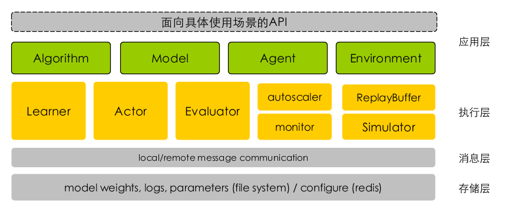

### 刑天强化学习库

#### 1  概述

##### 1.1   定位&特点

刑天强化学习库致力于解决大规模强化学习任务相关的性能问题，以提高研究人员的开发效率。平台基于分布式，高吞吐量的需求，抽象出并行训练、分布式多实例采样，高性能消息模型等基础组件，封装在平台底层框架中，由上层应用组合执行，减少开发者二次开发工作量。平台具有如下两个主要特点：

- **高性能**
  - 1K+ CPU并行数据采样
- **易于使用**
  - 模块化设计
  - 支持并行调参

1.2 系统架构

如上图所示，刑天的架构划分为四层，开发者和最终用户只需要关注应用层，平台提供其他三层的基础能力。

- **应用层**：各模块解耦设计，提供统一的对外接口，目前已集成众多业界主流的algorithm、model、agent、environment等模块，用户可以通过配置文件灵活配置，像搭建乐高似的搭建自己的强化学习任务系统，同时用户可以方便地注册自定义模块：
  - 算法，algorithm：对不同的强化学习算法提供统一的抽象封装，对外提供统一的数据处理`prepare_data()` 和 训练`train()`接口
  - 模型，model：定义算法的网络架构，设计上解耦深度学习后端，可以支持TensorFlow、PyTorch等主流框架
  - 代理智能体，agent：定义任务交互的相关属性，包含基于环境的最新state推导action，和执行动作后处理环境返回的反馈信息这两部分
  - 仿真环境，environment：对不同环境抽象统一接口，屏蔽不同仿真环境的差异性
- **存储层**： 提供对模型weights，训练/评估相关log，以及其他系统配置的同步与统一
- **消息层**：抽象统一的消息通信模型，提供分发，同步模型weights，以及汇总采样轨迹的能力
- **执行层**：提供高效的分布式处理能力，充分发挥硬件能力，提升强化学习效率，主要有如下特点：
  - 基于多进程的并行化
  - 基于共享内存的高效进程通信
  - 基于ZMQ的高效节点间通信
  - 自动化的跨节点代码和数据同步，如同单机般的使用体验

