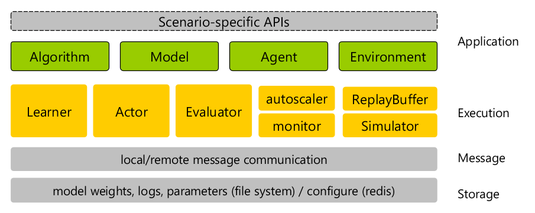

### XingTian

#### 1  Introduction

##### 1.1   Positioning and Features

XingTian Reinforcement Learning Library is dedicated to solving performance problems related to large-scale reinforcement learning tasks to improve the development efficiency of researchers. Based on the distributed and high-throughput requirements, the platform abstracts basic components such as parallel training, distributed multi-instance sampling, and high-performance message models, and encapsulates them in the bottom-layer framework of the platform. The upper-layer applications combine the components for execution, reducing the secondary development workload of developers. The platform has the following two main features: 

- **High performance** 
  - 1K+ CPU parallel data sampling 
- **Easy to use** 
  - Modular design 
  - Parallel parameter adjustment 

##### 1.2 System Architecture 

As shown in the preceding figure, XingTian's architecture is divided into four layers. Developers and end users only need to pay attention to the application layer. The Library provides basic capabilities at the other three layers. 

- **Application layer**: Each module is decoupled and provides unified external interfaces. The platform has integrated with many mainstream modules such as algorithm, model, agent, and environment. Users can flexibly configure the modules using the configuration file and set up their own reinforcement learning task system like setting up ‘Lego’. In addition, users can easily register customized modules. 
  - Algorithm: provides unified abstract encapsulation for different reinforcement learning algorithms and unified data processing `prepare_data()` and training `train()` interfaces. 
  - Model: defines the network architecture of the algorithm. The deep learning backend is decoupled in design, and mainstream frameworks such as TensorFlow and PyTorch are supported. 
  - Agent: defines task interaction attributes, including the latest state deduction action based on the environment and the feedback information returned by the environment after the action is executed. 
  - Simulation environment: abstracts unified interfaces for different environments to shield the differences between different simulation environments. 
- **Storage layer**: provides synchronization and unification of model weights, training/evaluation logs, and other system configurations. 
- **Message layer**: abstracts a unified message communication model, provides distribution and synchronization model weights, and summarizes sampling tracks. 
- **Execution layer**: provides efficient distributed processing capabilities, fully utilizes hardware capabilities, and improves reinforcement learning efficiency. The features are as follows: 
  - Multi-process-based parallelization 
  - Efficient process communication based on shared memory 
  - Efficient inter-node communication based on ZMQ 
  - Automatic cross-node code and data synchronization, providing the same experience as a single node. 
