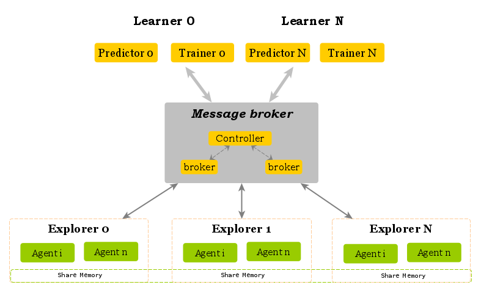
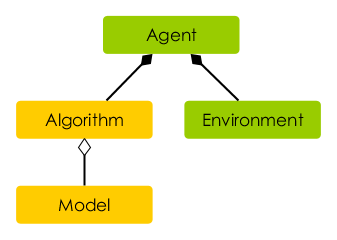

## 开发者指导

刑天基于分布式的`Broker`设计，将强化学习过程划分`Learner` 和`Explorer` 两部分。如下图所示，`Learner`通过broker 获取trajectory数据，用于模型策略的迭代更新；而`Explorer` 通过Broker 更新探索模型，以及收集探索的轨迹数据。 

<div align="center">

</div>


刑天强化学习库对开发者开放了Algorithm，Model，Agent，Environment四个应用模块的接口，其之间的关系如下图所示。Algorithm在训练进程中被`Learner`实例化，用于迭代更新模型的权重；迭代更新后的权重通过分布式后台分发给Agent用于环境的交互探索；而Agent只在数据采样进程`Explorer`进行实例化。开发者根据其具体需求，添加对应的类，并注册到系统，即可在Yaml配置文件中进行组合使用。

<div align="center">

</div>


### 增加新Algorithm

Algorithm 模块的工作目录为`xt/algorithm`。

系统提供了Algorithm基类，抽象出算法训练pipeline中阶段性操作，如：

- `prepare_data`： 数据的准备以及预处理
- `train_ready`：检查训练就绪状态
- `update_weights_map`：用于更新multi-Agent中各Agent和权重之间的策略关系
- `checkpoint_ready`：检查checkpoint的就绪状态
- `predict`：前向推理过程
- `save`：保存模型
- `restore`：恢复模型

用户在`xt/algorithm`目录下建立新的目标文件夹，在该文件夹下面实现`YOUR_ALGORITHM.py`. 用户Algorithm继承该基类之后，只需实现`prepare_data` 和 `train` 接口即可。并通过`@Registers.algorithm`注册到系统，示例如下。

```python
from xt.algorithm import Algorithm
from zeus.common.util.register import Registers


@Registers.algorithm
class NewAlgorithm(Algorithm):
    def train(self):
        # your train processing, to update the weights of models
    
    def prepare_data(self, train_data, **kwargs):
        # train_data point to the total trajectory of all agents
```


### 增加新Model

Model 模块的工作目录为`xt/model`。

Model 模块用于定义深度网络的架构，以执行网络的推理和训练过程。考虑到不同深度学习框架后端的差异，系统抽象了Tensorflow的`XtModel` 基类，使用Tensorflow 后端的用户可以直接继承该基类；而Pytorch后端用户可以按照传统的深度学习方法继承`torch.nn.Module`基类，自行实现模型的定义，预测和训练等逻辑。最后通过`@Registers.model` 注册到系统，示例如下。

```python
import torch
from zeus.common.util.register import Registers

# Pytorch 
@Registers.model
class NewPyTorchModel(torch.nn.Module):
    def __init(self, model_info):
        # init model architecture
    def forward(self, inputs):
        # inference 
        
# Tensorflow 
# tf_compat cover compactibility among different versions tensorflow
from xt.model.tf_compat import K, Dense, Input, Model, Adam  
from xt.model import XTModel

@Registers.model
class NewTFModel(XTModel):
    def create_model(self, model_info):
        # create model architecture
        
    def train(self, state, label):
        # train process
```

### 增加新Agent

Agent 模块负责算法与环境的交互逻辑，并整合multiagent中不同trajectory的数据，其工作目录为`xt/Agent`。一般情况下，开发者只需继承Agent基类，并实现`infer_action` 和`handle_env_feedback` 两个接口即可。

```python
from zeus.common.util.register import Registers
from xt.agent import Agent

@Registers.agent
class NewAgent(Agent):
    def infer_action(self, state, use_explore):
        """
        Infer an action with the `state`
        :param state:
        :param use_explore: Used True, in train, False in evaluate
        :return: action value
        """
        
    def handle_env_feedback(self, next_raw_state, reward, done, info, use_explore):
        # do process on the environment's feedback
```


### 增加新Environment

Environment 模块封装不同环境的差异性，提供兼容`Gym` 的API形态。开发者只需实现`init_env`,`reset` 和 `step` 方法。其工作目录为`xt/environment`。

```python
from xt.environment.environment import Environment
from zeus.common.util.register import Registers


@Registers.env
class NewEnv(Environment):
    """It encapsulates an openai gym environment."""

    def init_env(self, env_info):
        """
        create a atari environment instance

        :param: the config information of environment.
        :return: the instance of environment
        """

    def reset(self):
        """
        reset the environment, if done is true, must clear obs array

        :return: the observation of gym environment
        """
        return state

    def step(self, action, agent_index=0):
        """
        Run one timestep of the environment's dynamics.
        Accepts an action and returns a tuple (state, reward, done, info).

        :param action: action
        :param agent_index: the index of agent
        :return: state, reward, done, info
        """
        return state, reward, done, info
```

